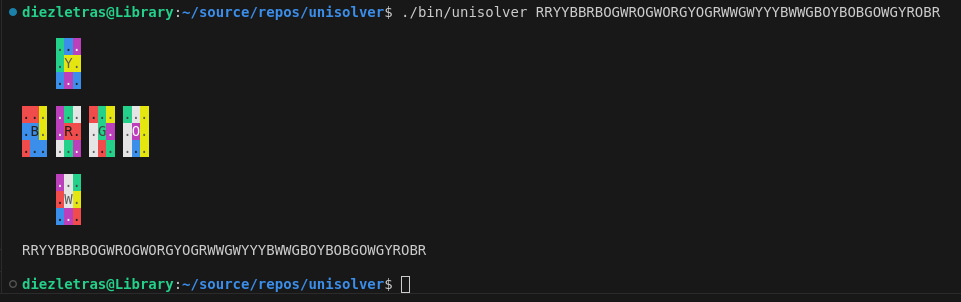

# UniSolver (3x3 Rubik's Cube)

In Progress ...

Rubik's Cube 3x3 scrambler, solver and timer.

## Build

```bash
make
```

## Details

* Uses BitMaps to represent the cube.
* Rotations are done by using bit twiddiling tricks.
* Going to use Fridrich (CFOP) method to solve the cube.

## Screenshots


