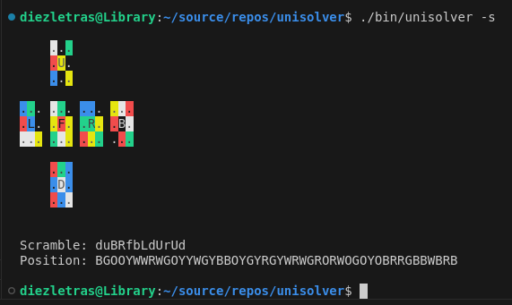

# RubikSolver (3x3 Rubik's Cube)

3x3 Rubik's Cube scrambler and solver.

In Progress ...


## Build

```bash
make
```

## Install

```bash
make install
```

## Details

* Uses BitMaps to represent the cube.
* Rotations are done by using [bit twiddiling tricks](https://graphics.stanford.edu/~seander/bithacks.html).
* Implements [Fridrich (CFOP)](https://ruwix.com/the-rubiks-cube/advanced-cfop-fridrich/) method to solve the cube.
* Supports 32 or 64 bit modes.

## Usage

rubiksolver

        -s => Generates a scramble.

        -s [algorithm/moves] => Performs the second argument's moves on the cube, outputs solution.

        -p [position string] => Sets the second argument's position on the cube, outputs solution.

## Screenshots



